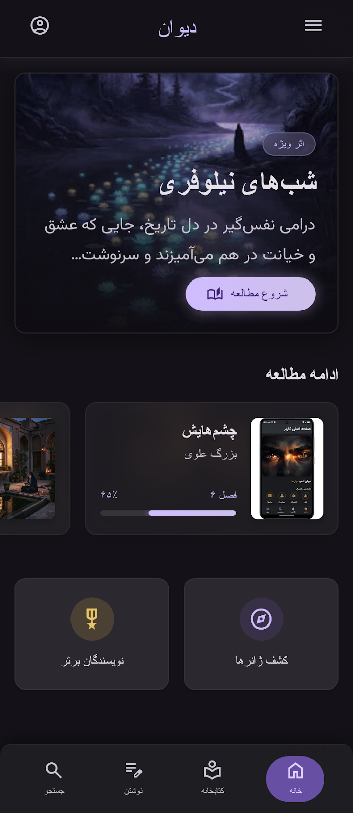
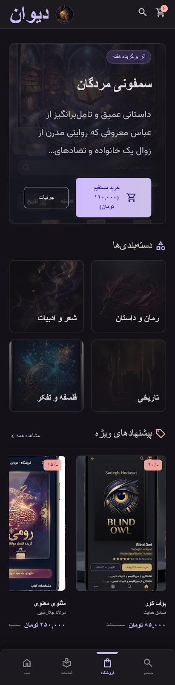
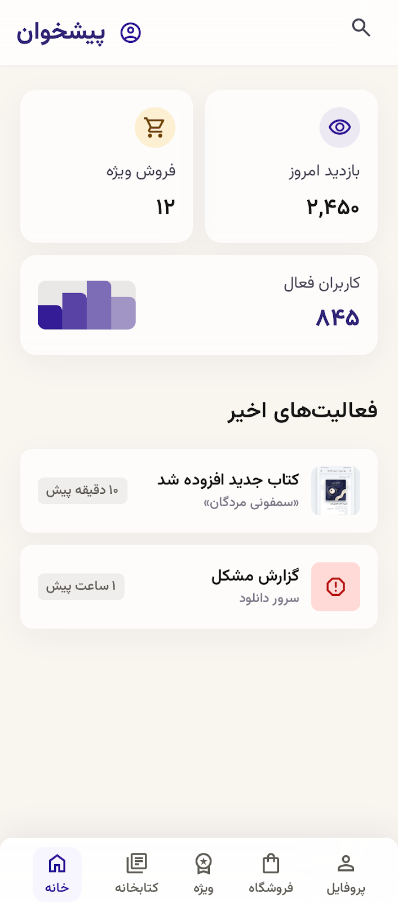

<div dir="rtl" align="right">

# دیوان | پلتفرم مدرن ادبیات فارسی

دموی تعاملی یک شبکه اجتماعی و فروشگاه ادبی برای نویسندگان، خوانندگان و تولیدکنندگان محتوای فارسی.

[](https://react.dev/)
[](https://vite.dev/)
[](#)
[](http://141.11.1.223:8295)

### [مشاهده دموی آنلاین](http://141.11.1.223:8295) · [دانلود معرفی‌نامه PDF](docs/divan-platform-introduction.pdf)

> این مخزن نسخه نمایشی Frontend است. اطلاعات، خرید، ورود و پرداخت به بک‌اند واقعی متصل نیستند و برای ارائه تجربه کاربری شبیه‌سازی شده‌اند.

---

## معرفی

«دیوان» تصویری اولیه از یک پلتفرم جامع ادبی است که مسیر کشف محتوا، مطالعه، دنبال‌کردن نویسنده، ساخت کتابخانه شخصی و خرید آثار دیجیتال را در یک رابط فارسی و راست‌چین گرد هم می‌آورد.

این دمو براساس فایل‌های UI/UX طراحی‌شده در Stitch ساخته شده و تمرکز آن بر نمایش کیفیت رابط، معماری کامپوننتی، واکنش‌گرایی و مسیرهای اصلی محصول است.

## تصاویر رابط کاربری

| خانه | فروشگاه | پیشخوان |
|:---:|:---:|:---:|
|  |  |  |

## بخش‌های پیاده‌سازی‌شده

- صفحه خانه با اثر ویژه، ادامه مطالعه و پیشنهاد آثار
- جستجو و کشف کتاب براساس عنوان و نویسنده
- دسته‌بندی‌های محتوایی و کارت‌های تعاملی کتاب
- کتابخانه شخصی و نمایش پیشرفت مطالعه
- فروشگاه دیجیتال، قیمت‌گذاری و سبد خرید نمایشی
- پروفایل حرفه‌ای نویسنده و آثار منتشرشده
- پیشخوان نویسنده با آمار بازدید، فروش و درآمد
- صفحه مطالعه متمرکز با امکان تغییر اندازه متن
- حالت تاریک و روشن
- رابط کاملاً RTL و واکنش‌گرا برای موبایل و دسکتاپ

## فناوری‌ها

- **React 19** برای رابط کاربری کامپوننتی
- **Vite 8** برای توسعه و ساخت سریع
- **Lucide React** برای آیکون‌ها
- **CSS خالص و Responsive** بدون وابستگی به فریم‌ورک CSS
- **Vazirmatn و Noto Serif Arabic** برای تایپوگرافی فارسی

## اجرای محلی

پیش‌نیاز: Node.js نسخه 20 یا جدیدتر.

```bash
git clone https://github.com/mahdihz05/literary-hub.git
cd literary-hub
npm install
npm run dev
```

پس از اجرا، آدرس نمایش‌داده‌شده توسط Vite را در مرورگر باز کنید.

## ساخت نسخه Production

```bash
npm ci
npm run build
```

فایل‌های آماده استقرار در پوشه `dist/` تولید می‌شوند. این پوشه را می‌توان روی Nginx، Apache، سرویس‌های Static Hosting یا CDN قرار داد.

## اجرای Docker

```bash
docker build -t literary-hub-demo .
docker run -d --name literary-hub-demo -p 8295:80 literary-hub-demo
```

سپس برنامه از طریق `http://localhost:8295` در دسترس است.

## ساختار پروژه

```text
literary-hub/
├── docs/                    # معرفی‌نامه و تصاویر مستندات
├── public/
│   └── assets/              # تصاویر محلی رابط
├── src/
│   ├── main.jsx             # صفحات، کامپوننت‌ها و تعاملات دمو
│   └── styles.css           # طراحی، RTL و واکنش‌گرایی
├── Dockerfile               # ساخت و سرو نسخه Production
├── nginx.conf               # تنظیمات سرو فایل‌های استاتیک
├── index.html
└── package.json
```

## مسیرهای قابل بررسی در دمو

ناوبری این نسخه بدون درخواست شبکه و به‌صورت Client-side انجام می‌شود:

1. خانه
2. کشف آثار و جستجو
3. کتابخانه من
4. فروشگاه
5. پروفایل نویسنده
6. پیشخوان نویسنده
7. صفحه مطالعه

تمام مقصدهای ناوبری داخل برنامه تعریف شده‌اند و برای مشاهده دمو به API یا دیتابیس نیاز ندارند.

## محدوده نسخه نمایشی

این نسخه برای ارائه بصری و بررسی تجربه کاربری ساخته شده است و شامل موارد زیر نیست:

- احراز هویت و حساب کاربری واقعی
- ذخیره اطلاعات در دیتابیس
- آپلود و نگهداری فایل
- پرداخت و ثبت سفارش واقعی
- API و پنل مدیریت متصل به سرور

دکمه‌های مرتبط با این قابلیت‌ها رفتار نمایشی دارند و درخواست ناموفق به سرویس خارجی ارسال نمی‌کنند.

## مسیر توسعه آینده

نسخه نهایی می‌تواند با معماری زیر تکمیل شود:

- Django و Django REST Framework برای Backend
- PostgreSQL برای ذخیره داده‌ها
- JWT برای احراز هویت
- ماژول‌های مستقل کاربران، کتاب‌ها، کتابخانه، فروشگاه، رسانه، پادکست، بلاگ، پرداخت و اعلان‌ها
- Object Storage برای فایل‌های صوتی، ویدیو و کتاب
- درگاه پرداخت و سیستم سهم فروشنده

## وضعیت دمو

- آدرس: [http://141.11.1.223:8295](http://141.11.1.223:8295)
- نوع انتشار: Static React Demo
- نیاز به ورود: ندارد
- پشتیبانی نمایش: موبایل، تبلت و دسکتاپ

---

این پروژه در حال حاضر یک Proof of Concept تعاملی برای ارائه محصول است.

</div>
